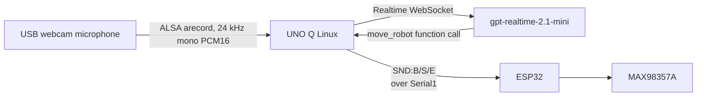

# Speech recognition and audio test build

Vietnamese version: [speech-test.vi.md](speech-test.vi.md)

The speech service can run by itself for hardware diagnosis, or in the normal
vision application. In integrated mode, hand-gesture detection is retired:
speech movement commands are accepted without familiar-face gating. The normal
app still uses face recognition for its LED expression and familiar-face sound.



## Files

- `python/local_microphone.py`: small ALSA/`arecord` capture adapter used on
  the UNO Q Linux side.
- `python/usb_mic_test.py`: standalone microphone-level and optional WAV test.
- `python/speech_test.py`: UNO Q local microphone service, legacy ESP32 TCP
  receiver, Realtime client, movement tool, and standalone sound-test entrypoint.
- `python/main.py`: normal vision application with speech running in the
  background; speech movement commands do not require a familiar face.
- `sketch/sketch.ino`: adds the safe `play_test_sound` Bridge function.
- `esp32_speech_test/speech_test/speech_test.ino`: legacy INMP441 diagnostic;
  it is no longer needed for the normal speech path.

## Hardware for this build

Connect the new webcam to a second USB port on the UNO Q. Its camera and
integrated microphone are both handled by the UNO Q Linux side; no INMP441
wiring or ESP32 microphone I2S pins are needed.

| Device | Signal | ESP32 pin |
| --- | --- | ---: |
| MAX98357A | BCLK | GPIO14 |
| MAX98357A | LRC/WS | GPIO13 |
| MAX98357A | DIN | GPIO32 |
| UNO Q ↔ ESP32 | UART2 RX/TX | GPIO16/GPIO17 |

Connect the MAX98357A speaker only to `OUTP` and `OUTN`; do not connect either
speaker lead to GND. The ESP32 speaker output remains 16 kHz mono. The USB
microphone is converted to 24 kHz mono by ALSA before it is sent to Realtime.

## Configure without committing secrets

1. If the ESP32 needs the network speaker stream, copy the gait firmware's
   `secrets.example.h` to its local `secrets.h`, fill in Wi-Fi credentials and
   the UNO Q LAN IP, and keep that file ignored.
2. Confirm the MAX98357A I2S pins do not collide with the current ESP32
   servo wiring.

On the UNO Q, provide the API key only in the process environment:

```sh
export OPENAI_API_KEY='your-key-here'
```

Do not put that value in this repository.

On the UNO Q, find the webcam's ALSA capture name:

```sh
python3 python/usb_mic_test.py --list
```

If that command says `arecord was not found`, install the board's ALSA utility
package once (if App Lab permits package installation):

```sh
sudo apt-get update
sudo apt-get install alsa-utils
```

Set the device to the webcam capture device. Prefer an ALSA `plughw` name so
ALSA can convert a webcam that only advertises 48 kHz to the 24 kHz Realtime
input format:

```sh
export UNO_Q_MIC_DEVICE='plughw:CARD=Webcam,DEV=0'
```

The card name is board-dependent; copy the actual value shown by `--list`.

## Run

1. Flash the normal UNO Q sketch after the added Bridge function is compiled.
2. First test the webcam microphone without OpenAI:

   ```sh
   python3 python/usb_mic_test.py --seconds 10
   ```

   Speak near the webcam. Expect `USB_MIC_LEVEL` lines with changing RMS/peak
   values and `USB_MIC_TEST_DONE ... signal_seen=yes`. Add
   `--output webcam-mic-test.wav` if you want to save a short recording.
3. For the standalone speech/sound test, temporarily set in `python/main.py`:

   ```python
   RUN_SPEECH_TEST_ONLY = True
   ```

   This makes App Lab launch only the speech process inside its own Python
   runtime, where `arduino.app_utils.Bridge` is available. It does not run the
   normal camera/vision loop while enabled.

4. Press **Run** in App Lab. App Lab installs the Python dependency from
   `python/requirements.txt` and starts the speech test.

   The project manifest exposes the legacy ESP32 speech input port and the
   manual media ports to the LAN. The normal USB microphone path does not use
   port 3333; it remains exposed only for compatibility with old firmware:

   ```yaml
   ports:
     - 3333
     - 3334
     - 3335
     - 3336
     - 8080
   ```

   The LAN port declarations are needed for the laptop media clients and the
   optional legacy ESP32 receiver; local USB microphone capture itself does not
   require an exposed speech-input port.

5. Confirm the App Lab console shows:

   ```text
   Speech test input: USB webcam microphone device=...
   Using UNO Q USB microphone: device=... format=PCM16 mono/24000Hz frame=20ms
   ```

   The speech test currently uses a required Realtime tool call so a detected
   voice turn produces a deterministic hardware command. It also prints the
   Realtime transcript and tool-call arguments for diagnosis.

6. Start the ESP32 gait firmware with the MAX98357A and LittleFS sound files.
7. Say one of these commands near the webcam:

   - English: `play beep`, `play success`, or `play error`.
   - Vietnamese: `phát tiếng bíp`, `báo thành công`, or `báo lỗi`.

8. Set `RUN_SPEECH_TEST_ONLY = False` and press **Run** again to restore the
   normal application.

## Integrated normal application

Leave `RUN_SPEECH_TEST_ONLY = False`. The normal application starts the local
USB microphone capture and Realtime session in the background. It exposes `move_robot`
to the model and maps these tool commands to the existing ESP32 gait bytes:

| Speech tool command | UART byte | Examples |
| --- | --- | --- |
| `forward` / `backward` | `w` / `b` | “walk forward”, “đi tới” |
| `turn_left` / `turn_right` | `a` / `d` | “turn left”, “quay phải” |
| `stop` / `hold` | `s` / `z` | “stop”, “giữ nguyên” |
| `sit` / `prone` / `stand` | `q` / `c` / `s` | “ngồi xuống”, “nằm xuống” |
| `chase` | ball-tracking mode | “follow the ball”, “đuổi bóng” |
| `wave` / `bounce` / `jump` | `g` / `u` / `j` | matching English/Vietnamese words |

The UNO Q requests `success` after every accepted speech movement and `beep`
once when face recognition changes into the familiar state. These are local
events, so the model never needs to call a sound tool in integrated mode.

Do not install packages into the system Python or a separate virtual
environment for this mode. App Lab installs `python/requirements.txt` into
the runtime that provides `arduino.app_utils.Bridge`.

The sound UART uses a short framed command containing one uppercase byte:
`SND:B` = beep, `SND:S` = success, and `SND:E` = error. The ESP32 silently
discards invalid/noisy frames. The UNO Q terminal should show
`UNO Q USB mic RX` with mono PCM frame counts and
microphone levels, followed by `SPEECH_RECEIVED`, a Realtime transcript,
`Realtime tool call`,
and `UNO Q sent command to ESP32`. The UNO Q MCU serial output should show
`UNO Q UART TX: SND:B (PLAY:beep)` (or `SND:S`/`SND:E`). The ESP32 USB serial monitor
should show `UART_COMMAND_RECEIVED`, `COMMAND_RECEIVED`,
`PLAYBACK_STATUS STARTED`, and
`PLAYBACK_STATUS DONE`, together with the existing `ACK:CMD_RECEIVED`,
`ACK:WAV_STARTED`, and `SOUND_DONE` messages. These messages identify whether
the fault is before or after the command reaches the ESP32.

## Install WAV files

Place the files beside the ESP32 `.ino` file before uploading the filesystem:

```text
data/
└── sounds/
    ├── beep.wav
    ├── success.wav
    └── error.wav
```

Use PCM, 16-bit, mono, 16 kHz WAV files. In Arduino IDE, upload this folder
with the ESP32 LittleFS data uploader. The firmware opens the files from
`/sounds/<name>.wav`.

## Output-only LittleFS test

To test only the MAX98357A output, open and flash:

```text
esp32_speech_test/littlefs_output_test/littlefs_output_test.ino
```

This sketch does not use Wi-Fi, the microphone, UART, or OpenAI. It mounts the
existing LittleFS image and plays `beep.wav`, `success.wav`, and `error.wav`
once in that order, after a generated 1 kHz tone. Open the ESP32 serial
monitor at 115200 baud and expect:

```text
TONE_START 1000Hz 2000ms
TONE_DONE
WAV_START /sounds/beep.wav ...
WAV_DONE /sounds/beep.wav
WAV_START /sounds/success.wav ...
WAV_DONE /sounds/success.wav
WAV_START /sounds/error.wav ...
WAV_DONE /sounds/error.wav
```

Uploading the new sketch normally does not erase LittleFS, so re-upload the
filesystem only if the test reports `FILE_NOT_FOUND`. Do not use a LittleFS
format option for this test.

If `TONE_DONE` appears but no tone is audible, check MAX98357A power, `SD_MODE`,
I2S wiring, and the speaker connection. If the tone is audible but WAV playback
is silent, the issue is in the WAV data rather than the amplifier path.

If `usb_mic_test.py --list` reports no capture device, check that the webcam is
connected to the UNO Q, then inspect `dmesg`/`arecord --list-devices` on the
board. If the device appears but capture fails, use the exact `plughw` name
shown by the listing rather than `default`. If the old ESP32 firmware keeps
logging failed connections to port 3333, leave the UNO Q input at its default
USB mode and disable its obsolete INMP441 stream in that ESP32 build; port 3333
is no longer part of the normal speech path.

The supplied `dog_esp32.ino` now defaults `DOG_ENABLE_MIC_STREAM` to `0` and
prints `mic=disabled`. Leave it at that value for the webcam build; define it
as `1` only when deliberately testing the legacy INMP441/TCP path.

The standalone `esp32_speech_test` sketch remains useful for output-only
LittleFS diagnostics, but it is not the microphone source for this build. The
main gait firmware must keep the `SND:B/S/E` parser and `/sounds/*.wav`
playback so it can accept sound frames from the UNO Q alongside its existing
`CMD:<char>` frames.
