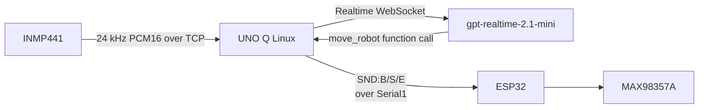

# Speech recognition and audio test build

The speech service can run by itself for hardware diagnosis, or in the normal
vision application. In integrated mode, hand-gesture detection is retired:
speech movement commands are accepted without familiar-face gating. The normal
app still uses face recognition for its LED expression and familiar-face sound.



## Files

- `python/speech_test.py`: UNO Q TCP receiver, Realtime client, movement tool,
  and standalone sound-test entrypoint.
- `python/main.py`: normal vision application with speech running in the
  background; speech movement commands do not require a familiar face.
- `sketch/sketch.ino`: adds the safe `play_test_sound` Bridge function.
- `esp32_speech_test/speech_test/speech_test.ino`: one-microphone capture and local tone playback.

## Wiring for this first test

Use one INMP441 and one MAX98357A. The pin numbers below are starting points;
check them against the existing ESP32 servo wiring before powering the board.

| Device | Signal | ESP32 pin |
| --- | --- | ---: |
| INMP441 | SCK/BCLK | GPIO26 |
| INMP441 | WS/LRCLK | GPIO25 |
| INMP441 | SD | GPIO33 |
| INMP441 | L/R | GND (left slot) |
| MAX98357A | BCLK | GPIO14 |
| MAX98357A | LRC/WS | GPIO13 |
| MAX98357A | DIN | GPIO32 |
| UNO Q ↔ ESP32 | UART2 RX/TX | GPIO16/GPIO17 |

Connect grounds together. Power the INMP441 from 3.3 V. Connect the MAX98357A
speaker only to `OUTP` and `OUTN`; do not connect either speaker lead to GND.
Set the MAX98357A `SD_MODE` for the left channel.

The ESP32 test firmware uses separate I2S controllers: the microphone runs at
24 kHz for Realtime input, while the MAX98357A test tone runs at 16 kHz. This
is deliberate because the MAX98357A does not support a 24 kHz LRCLK.

## Configure without committing secrets

1. Copy `esp32_speech_test/secrets.example.h` to `esp32_speech_test/secrets.h`.
2. Fill in Wi-Fi credentials and the UNO Q's LAN IP. `secrets.h` is ignored.
3. Confirm the I2S pins do not collide with the current ESP32 firmware.

On the UNO Q, provide the API key only in the process environment:

```sh
export OPENAI_API_KEY='your-key-here'
```

Do not put that value in this repository.

## Run

1. Flash the normal UNO Q sketch after the added Bridge function is compiled.
2. For the standalone sound-only test, temporarily set in `python/main.py`:

   ```python
   RUN_SPEECH_TEST_ONLY = True
   ```

   This makes App Lab launch only the speech process inside its own Python
   runtime, where `arduino.app_utils.Bridge` is available. It does not run the
   normal camera/vision loop while enabled.

3. Press **Run** in App Lab. App Lab installs the Python dependency from
   `python/requirements.txt` and starts the speech test.

   The project manifest exposes TCP port 3333 to the LAN:

   ```yaml
   ports:
     - 3333
   ```

   This is required because the Python process runs inside the App Lab
   runtime; without the port declaration, the ESP32 cannot reach the listener.

4. Confirm the App Lab console shows:

   ```text
   Listening for ESP32 PCM audio on 0.0.0.0:3333.
   ```

   The speech test currently uses a required Realtime tool call so a detected
   voice turn produces a deterministic hardware command. It also prints the
   Realtime transcript and tool-call arguments for diagnosis.

5. Flash and start `esp32_speech_test/speech_test/speech_test.ino`.
6. Say one of these commands near the INMP441:

   - English: `play beep`, `play success`, or `play error`.
   - Vietnamese: `phát tiếng bíp`, `báo thành công`, or `báo lỗi`.

7. Set `RUN_SPEECH_TEST_ONLY = False` and press **Run** again to restore the
   normal application.

## Integrated normal application

Leave `RUN_SPEECH_TEST_ONLY = False`. The normal application starts the same
TCP listener and Realtime session in the background. It exposes `move_robot`
to the model and maps these tool commands to the existing ESP32 gait bytes:

| Speech tool command | UART byte | Examples |
| --- | --- | --- |
| `forward` / `backward` | `w` / `b` | “walk forward”, “đi tới” |
| `turn_left` / `turn_right` | `a` / `d` | “turn left”, “quay phải” |
| `stop` / `hold` | `s` / `z` | “stop”, “giữ nguyên” |
| `sit` / `prone` / `stand` | `q` / `c` / `s` | “ngồi xuống”, “nằm xuống” |
| `chase` | ball-tracking mode | “follow the ball”, “đuổi bóng” |
| `wave` / `bounce` / `jump` | `g` / `u` / `j` | matching English/Vietnamese words |

The UNO Q requests `success` after every accepted speech movement and `beep`
once when face recognition changes into the familiar state. These are local
events, so the model never needs to call a sound tool in integrated mode.

Do not install packages into the system Python or a separate virtual
environment for this mode. App Lab installs `python/requirements.txt` into
the runtime that provides `arduino.app_utils.Bridge`.

The sound UART uses a short framed command containing one uppercase byte:
`SND:B` = beep, `SND:S` = success, and `SND:E` = error. The ESP32 silently
discards invalid/noisy frames. The UNO Q terminal should show
`UNO Q audio RX` with PCM frame counts and
microphone levels, followed by `SPEECH_RECEIVED`, a Realtime transcript,
`Realtime tool call`,
and `UNO Q sent command to ESP32`. The UNO Q MCU serial output should show
`UNO Q UART TX: SND:B (PLAY:beep)` (or `SND:S`/`SND:E`). The ESP32 USB serial monitor
should show `UART_COMMAND_RECEIVED`, `COMMAND_RECEIVED`,
`PLAYBACK_STATUS STARTED`, and
`PLAYBACK_STATUS DONE`, together with the existing `ACK:CMD_RECEIVED`,
`ACK:WAV_STARTED`, and `SOUND_DONE` messages. These messages identify whether
the fault is before or after the command reaches the ESP32.

## Install WAV files

Place the files beside the ESP32 `.ino` file before uploading the filesystem:

```text
data/
└── sounds/
    ├── beep.wav
    ├── success.wav
    └── error.wav
```

Use PCM, 16-bit, mono, 16 kHz WAV files. In Arduino IDE, upload this folder
with the ESP32 LittleFS data uploader. The firmware opens the files from
`/sounds/<name>.wav`.

## Output-only LittleFS test

To test only the MAX98357A output, open and flash:

```text
esp32_speech_test/littlefs_output_test/littlefs_output_test.ino
```

This sketch does not use Wi-Fi, the microphone, UART, or OpenAI. It mounts the
existing LittleFS image and plays `beep.wav`, `success.wav`, and `error.wav`
once in that order, after a generated 1 kHz tone. Open the ESP32 serial
monitor at 115200 baud and expect:

```text
TONE_START 1000Hz 2000ms
TONE_DONE
WAV_START /sounds/beep.wav ...
WAV_DONE /sounds/beep.wav
WAV_START /sounds/success.wav ...
WAV_DONE /sounds/success.wav
WAV_START /sounds/error.wav ...
WAV_DONE /sounds/error.wav
```

Uploading the new sketch normally does not erase LittleFS, so re-upload the
filesystem only if the test reports `FILE_NOT_FOUND`. Do not use a LittleFS
format option for this test.

If `TONE_DONE` appears but no tone is audible, check MAX98357A power, `SD_MODE`,
I2S wiring, and the speaker connection. If the tone is audible but WAV playback
is silent, the issue is in the WAV data rather than the amplifier path.

If the ESP32 connects to Wi-Fi but cannot connect to TCP port 3333, verify the
UNO Q IP address in `secrets.h`, that both devices are on the same LAN, that
the UNO Q process printed the listening message, and that no other process is
already using port 3333.

The repository currently contains the `SND:` parser and LittleFS playback in
the separate `esp32_speech_test` sketch, but not the main ESP32 gait sketch.
Before running the integrated robot build, merge that same `SND:B/S/E` parser
and `/sounds/*.wav` playback into the gait firmware so it can accept both the
existing `CMD:<char>` frames and the new sound frames.
