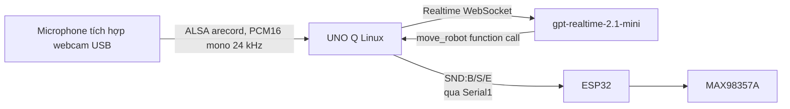

# Bản dựng kiểm tra nhận dạng giọng nói và âm thanh

Bản tiếng Anh: [speech-test.md](speech-test.md)

Dịch vụ speech có thể chạy độc lập để chẩn đoán phần cứng hoặc chạy trong ứng
dụng thị giác bình thường. Ở chế độ tích hợp, nhận diện cử chỉ tay được tắt:
các lệnh di chuyển bằng giọng nói được chấp nhận mà không cần kiểm tra khuôn
mặt quen thuộc. Ứng dụng bình thường vẫn dùng nhận diện khuôn mặt cho biểu cảm
LED và âm thanh báo khuôn mặt quen thuộc.



## Các file

- `python/local_microphone.py`: bộ thu ALSA/`arecord` nhỏ chạy trên Linux UNO Q.
- `python/usb_mic_test.py`: bài kiểm tra mức microphone USB và tùy chọn lưu WAV.
- `python/speech_test.py`: bộ thu microphone cục bộ, bộ nhận TCP ESP32 cũ,
  client Realtime, công cụ di chuyển và entrypoint kiểm tra âm thanh độc lập.
- `python/main.py`: Ứng dụng thị giác bình thường với speech chạy nền; lệnh di
  chuyển bằng giọng nói không yêu cầu khuôn mặt quen thuộc.
- `sketch/sketch.ino`: Bổ sung hàm Bridge an toàn `play_test_sound`.
- `esp32_speech_test/speech_test/speech_test.ino`: công cụ chẩn đoán INMP441 cũ;
  không còn cần cho đường speech bình thường.

## Phần cứng của bản dựng này

Nối webcam mới vào cổng USB thứ hai của UNO Q. Camera và microphone tích hợp
đều do Linux trên UNO Q xử lý; không cần nối INMP441 hoặc các chân I2S
microphone trên ESP32.

| Thiết bị | Tín hiệu | Chân ESP32 |
| --- | --- | ---: |
| MAX98357A | BCLK | GPIO14 |
| MAX98357A | LRC/WS | GPIO13 |
| MAX98357A | DIN | GPIO32 |
| UNO Q ↔ ESP32 | UART2 RX/TX | GPIO16/GPIO17 |

Chỉ nối loa của MAX98357A vào `OUTP` và `OUTN`; không nối dây loa nào vào
GND. Đầu ra loa ESP32 vẫn là mono 16 kHz. ALSA chuyển microphone USB thành
mono 24 kHz trước khi gửi tới Realtime.

## Cấu hình mà không commit secret

1. Nếu ESP32 cần luồng loa qua mạng, sao chép `secrets.example.h` của firmware
   dáng đi thành `secrets.h` cục bộ, điền Wi-Fi và IP LAN của UNO Q, rồi giữ
   file đó ở trạng thái ignore.
2. Xác nhận các chân I2S của MAX98357A không xung đột với servo ESP32.

Trên UNO Q, chỉ cung cấp API key trong biến môi trường của tiến trình:

```sh
export OPENAI_API_KEY='your-key-here'
```

Không đặt giá trị đó trong repository này.

Trên UNO Q, tìm tên thiết bị thu ALSA của webcam:

```sh
python3 python/usb_mic_test.py --list
```

Nếu lệnh báo `arecord was not found`, cài gói tiện ích ALSA một lần trên board
(nếu App Lab cho phép cài package):

```sh
sudo apt-get update
sudo apt-get install alsa-utils
```

Đặt thiết bị microphone. Nên dùng tên `plughw` để ALSA có thể đổi webcam chỉ
hỗ trợ 48 kHz về định dạng Realtime 24 kHz:

```sh
export UNO_Q_MIC_DEVICE='plughw:CARD=Webcam,DEV=0'
```

Tên card phụ thuộc vào board; hãy dùng đúng giá trị hiển thị bởi `--list`.

## Chạy

1. Nạp sketch UNO Q bình thường sau khi biên dịch có hàm Bridge bổ sung.
2. Kiểm tra microphone webcam trước, không cần OpenAI:

   ```sh
   python3 python/usb_mic_test.py --seconds 10
   ```

   Nói gần webcam. Cần thấy các dòng `USB_MIC_LEVEL` thay đổi và
   `USB_MIC_TEST_DONE ... signal_seen=yes`. Có thể thêm
   `--output webcam-mic-test.wav` để lưu bản ghi ngắn.
3. Để kiểm tra speech/âm thanh độc lập, tạm thời đặt trong `python/main.py`:

   ```python
   RUN_SPEECH_TEST_ONLY = True
   ```

   Thiết lập này khiến App Lab chỉ khởi chạy tiến trình speech trong runtime
   Python riêng, nơi có `arduino.app_utils.Bridge`. Khi bật, vòng lặp
   camera/thị giác bình thường không chạy.

4. Nhấn **Run** trong App Lab. App Lab cài dependency Python từ
   `python/requirements.txt` và khởi động bài kiểm tra speech.

   Manifest của project mở cổng speech input ESP32 cũ và các cổng media thủ công
   ra LAN. Đường microphone USB bình thường không dùng cổng 3333; cổng này
   chỉ giữ lại để tương thích firmware cũ:

   ```yaml
   ports:
     - 3333
     - 3334
     - 3335
     - 3336
     - 8080
   ```

   Các khai báo cổng LAN cần cho client media trên laptop và bộ nhận ESP32 cũ
   tùy chọn; microphone USB cục bộ không cần mở cổng speech input ra mạng.

5. Xác nhận console App Lab hiển thị:

   ```text
   Speech test input: USB webcam microphone device=...
   Using UNO Q USB microphone: device=... format=PCM16 mono/24000Hz frame=20ms
   ```

   Bài kiểm tra speech hiện dùng một Realtime tool call bắt buộc để mỗi lượt
   giọng nói được phát hiện tạo ra lệnh phần cứng xác định. Bài kiểm tra cũng in
   transcript Realtime và các đối số của tool call để chẩn đoán.

6. Khởi động firmware dáng đi ESP32 với MAX98357A và file âm thanh LittleFS.
7. Nói một trong các lệnh sau gần webcam:

   - Tiếng Anh: `play beep`, `play success` hoặc `play error`.
   - Tiếng Việt: `phát tiếng bíp`, `báo thành công` hoặc `báo lỗi`.

8. Đặt `RUN_SPEECH_TEST_ONLY = False` rồi nhấn **Run** lại để khôi phục ứng
   dụng bình thường.

## Ứng dụng bình thường có tích hợp speech

Giữ `RUN_SPEECH_TEST_ONLY = False`. Ứng dụng bình thường khởi động bộ thu
microphone USB cục bộ và phiên Realtime ở chế độ nền. Ứng dụng cung cấp `move_robot` cho model và
ánh xạ các lệnh tool này thành byte dáng đi ESP32 hiện có:

| Lệnh speech | Byte UART | Ví dụ |
| --- | --- | --- |
| `forward` / `backward` | `w` / `b` | “walk forward”, “đi tới” |
| `turn_left` / `turn_right` | `a` / `d` | “turn left”, “quay phải” |
| `stop` / `hold` | `s` / `z` | “stop”, “giữ nguyên” |
| `sit` / `prone` / `stand` | `q` / `c` / `s` | “ngồi xuống”, “nằm xuống” |
| `chase` | chế độ theo dõi bóng | “follow the ball”, “đuổi bóng” |
| `wave` / `bounce` / `jump` | `g` / `u` / `j` | các từ tiếng Anh/Việt tương ứng |

UNO Q yêu cầu `success` sau mỗi lệnh di chuyển bằng speech được chấp nhận và
phát `beep` một lần khi nhận diện khuôn mặt chuyển sang trạng thái quen thuộc.
Đây là các sự kiện cục bộ, nên model không cần gọi sound tool trong chế độ tích
hợp.

Không cài package vào Python hệ thống hoặc một virtual environment riêng cho
chế độ này. App Lab cài `python/requirements.txt` vào runtime cung cấp
`arduino.app_utils.Bridge`.

UART âm thanh dùng frame lệnh ngắn chứa một byte chữ hoa:
`SND:B` = beep, `SND:S` = success và `SND:E` = error. ESP32 âm thầm bỏ qua các
frame sai hoặc nhiễu. Terminal UNO Q phải hiển thị `UNO Q USB mic RX` cùng số
frame PCM mono và mức microphone, tiếp đó là `SPEECH_RECEIVED`, transcript
Realtime, `Realtime tool call` và `UNO Q sent command to ESP32`. Output serial
MCU UNO Q phải hiển thị `UNO Q UART TX: SND:B (PLAY:beep)` (hoặc `SND:S`/
`SND:E`). Serial monitor USB ESP32 phải hiển thị `UART_COMMAND_RECEIVED`,
`COMMAND_RECEIVED`, `PLAYBACK_STATUS STARTED` và `PLAYBACK_STATUS DONE`, cùng
các message hiện có `ACK:CMD_RECEIVED`, `ACK:WAV_STARTED` và `SOUND_DONE`. Các
message này cho biết lỗi xảy ra trước hay sau khi lệnh tới ESP32.

## Cài file WAV

Đặt các file cạnh file `.ino` của ESP32 trước khi upload filesystem:

```text
data/
└── sounds/
    ├── beep.wav
    ├── success.wav
    └── error.wav
```

Dùng file WAV PCM, 16-bit, mono, 16 kHz. Trong Arduino IDE, upload thư mục này
bằng công cụ upload dữ liệu LittleFS của ESP32. Firmware mở file tại
`/sounds/<name>.wav`.

## Kiểm tra LittleFS chỉ đầu ra

Để chỉ kiểm tra đầu ra MAX98357A, mở và nạp:

```text
esp32_speech_test/littlefs_output_test/littlefs_output_test.ino
```

Sketch này không dùng Wi-Fi, microphone, UART hoặc OpenAI. Sketch mount image
LittleFS hiện có và phát `beep.wav`, `success.wav`, `error.wav` một lần theo
đúng thứ tự, sau một tone 1 kHz được tạo bằng phần mềm. Mở serial monitor ESP32
ở baud 115200 và chờ:

```text
TONE_START 1000Hz 2000ms
TONE_DONE
WAV_START /sounds/beep.wav ...
WAV_DONE /sounds/beep.wav
WAV_START /sounds/success.wav ...
WAV_DONE /sounds/success.wav
WAV_START /sounds/error.wav ...
WAV_DONE /sounds/error.wav
```

Việc nạp sketch mới bình thường không xóa LittleFS, nên chỉ upload lại
filesystem nếu bài kiểm tra báo `FILE_NOT_FOUND`. Không dùng tùy chọn format
LittleFS cho bài kiểm tra này.

Nếu xuất hiện `TONE_DONE` nhưng không nghe thấy tone, kiểm tra nguồn
MAX98357A, `SD_MODE`, dây I2S và kết nối loa. Nếu nghe được tone nhưng phát WAV
im lặng, vấn đề nằm ở dữ liệu WAV chứ không phải đường khuếch đại.

Nếu `usb_mic_test.py --list` không hiển thị thiết bị thu, kiểm tra webcam đã
được cắm vào UNO Q rồi xem `dmesg`/`arecord --list-devices` trên board. Nếu
thiết bị xuất hiện nhưng không thu được, dùng đúng tên `plughw` trong danh sách
thay vì `default`. Nếu firmware ESP32 cũ vẫn liên tục báo lỗi kết nối cổng
3333, giữ chế độ input mặc định USB trên UNO Q và tắt luồng INMP441 cũ trong
firmware ESP32; cổng 3333 không còn thuộc đường speech bình thường.

File `dog_esp32.ino` được cung cấp hiện mặc định đặt
`DOG_ENABLE_MIC_STREAM` bằng `0` và in `mic=disabled`. Giữ giá trị này cho
bản dựng dùng webcam; chỉ đặt thành `1` khi cố ý kiểm tra đường INMP441/TCP cũ.

Sketch `esp32_speech_test` riêng vẫn hữu ích để chẩn đoán LittleFS/loa, nhưng
không còn là nguồn microphone của bản dựng này. Firmware dáng đi chính phải
giữ parser `SND:B/S/E` và phần phát `/sounds/*.wav` để nhận frame âm thanh từ
UNO Q cùng với frame `CMD:<char>` hiện có.
