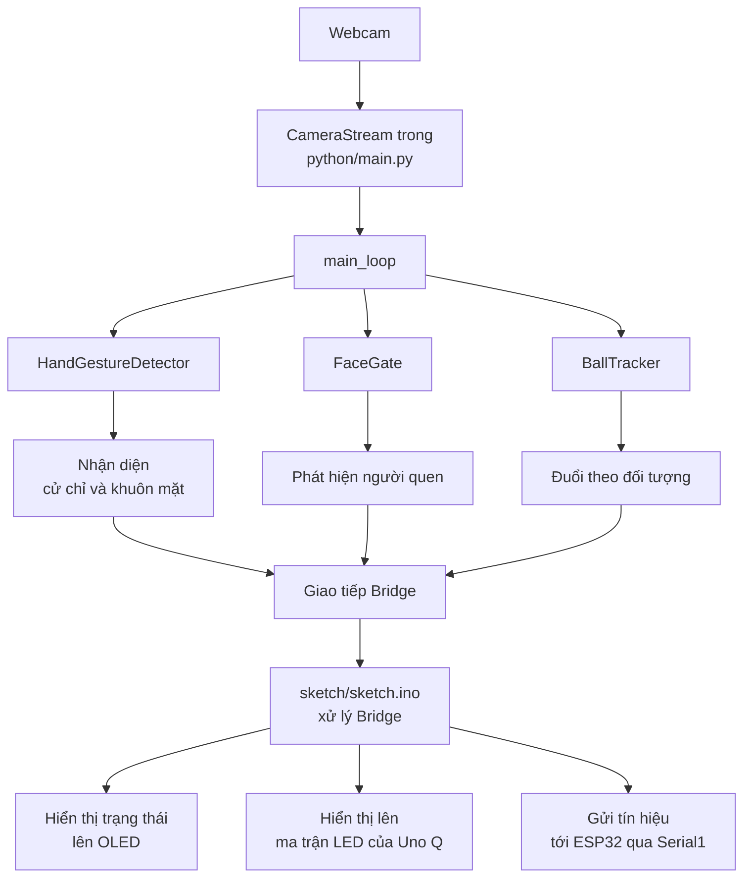

# Cấu trúc code và luồng dữ liệu RoboDog trên Arduino Uno Q
## Kiến trúc thượng tầng
Chương trình chính của robot được chia làm 2 nửa, chạy trên 2 máy tính nhúng khác nhau:

- **Arduino Uno Q**: Chia làm 2 bộ phận
  - Chip Qualcomm Dragonwing QRB2210: Chạy hệ điều hành Debian Linux, lập trình bằng ngôn ngữ Python. Xử lý đầu vào hình ảnh từ camera, chạy mô hình nhận dạng, so sánh với cơ sở dữ liệu khuôn mặt, phát hiện cử chỉ, đồ vật (quả bóng). Đưa ra lệnh hành động cho robot dựa trên kết quả xử lý.
  - Chip STM32U585: Chạy hệ điều hành Arduino Zephyr, lập trình bằng ngôn ngữ C++. Chức năng làm cầu nối từ chương trình xử lý hình ảnh tới chương trình xử lý vận động trên chip ESP32 thông qua Serial. Đồng thời hiển thị một số thông tin cần thiết lên màn hình OLED SSD1306 và ma trận LED có sẵn trên bảng mạch.
- **ESP32S**:
  - Nhận tín hiệu từ Arduino Uno Q, kết hợp với việc đọc cảm ứng góc nghiêng MPU6050 và thuật toán PID để tinh chỉnh sai số, từ đó gửi tín hiệu điều khiển các servo ST3215 để robot chuyển động.
 
Hướng dẫn này sẽ chỉ nói tới phần code trên Arduino Uno Q.

## Luồng dữ liệu tổng quan trên Uno Q



## Chỉ mục các file code
| Đường dẫn | Chức năng |
| --- | --- |
| `sketch/sketch.ino` | Code xử lý Bridge - giao tiếp giữa 2 chip trong Arduino Uno Q. Xử lý đầu ra OLED SSD1306, ma trận LED có sẵn, đưa tín hiệu tới ESP32 thông qua Serial1 |
| `python/main.py` | Code điều phối chính: Xử lý luồng hình ảnh từ camera; Chạy mô hình nhận dạng khuôn mặt, cử chỉ, đồ vật; Chuyển đổi trạng thái robot; Giao tiếp Bridge. |
| `python/detector.py` | Code nhận dạng cử chỉ bàn tay, sử dụng mô hình MediaPipe. |
| `python/hand_models/` | Thư mục chứa các file mô hình MediaPipe giúp nhận dạng bàn tay. |
| `python/face_gate.py` | Code nhận dạng khuông mặt, sử dụng mô hình YuNet và SFace. |
| `python/enroll_faces.py` | Code xây dựng file cơ sở dữ liệu khuôn mặt `known_faces_db.json`. |
| `python/known_faces/` | Thư mục chứa ảnh chân dung để làm đầu vào xây dựng dữ liệu khuôn mặt. |
| `python/known_faces_db.json` | File cơ sở dữ liệu khuôn mặt, được `face_gate.py` sử dụng để nhận diện khuôn mặt người quen. |
| `python/ball_tracker.py` | Code phát hiện con người và nhận diện đồ vật (quả bóng), sử dụng mô hình YOLOv8n. Đưa ra lệnh di chuyển theo đối tượng được nhận diện. |
| `python/requirements.txt` | Danh sách các thư viện Python cần sử dụng. |

## Quá trình khởi động
1. `sketch/sketch.ino` mở cổng `Serial1` và cổng I2C kết nối đến OLED, khởi động ma trận LED trên Arduino UNO Q, và thư viện Arduino Router Bridge.
2. `sketch/sketch.ino` khai báo 3 chương trình giao tiếp trên Bridge: `update_oled`, `send_motor_command`, và `update_face_matrix`.
3. `python/main.py` khởi động, chạy `Bridge`, mở luồng hình ảnh `CameraStream` từ webcam.
4. `python/main.py` khai báo 3 chương trình xử lý hình ảnh: `HandGestureDetector`, `FaceGate`, và `BallTracker`.
5. `verify_face_models()` kiểm tra mô hình YuNet và SFace đã cài đặt có tương thích với OpenCV không.
6. `App.run(user_loop=main_loop)` chạy vòng lặp chính `main_loop`.

## Luồng dữ liệu
Mỗi vòng lặp của `main_loop` trong `python/main.py` sẽ chạy theo thứ tự các bước sau:
1. Đọc khung hình camera mới nhất.
2. Lật ngang khung hình để tiện cho việc giao tiếp với người điều khiển đang đứng đối diện với robot.
3. Xét trạng thái hiện tại, nếu đang đuổi theo mục tiêu, lập tức chạy theo nhánh đuổi mục tiêu.
4. Nếu không, tuân theo mệnh lệnh đang có đến khi hết thời gian chờ.
5. Chạy code nhận diện cử chỉ bàn tay với khung hình mới nhất.
6. Chạy code nhận diện khuôn mặt. Nếu không nhìn thấy mặt mà nhìn thấy chân, ra lệnh ngẩng camera lên.
7. Chuyển kết quả nhận diện thành mệnh lệnh, bao gồm các thành phần:
   - Lệnh di chuyển tới ESP32.
   - Hiển thị tin nhắn debug lên OLED SSD1306.
   - Cập nhận hiển thị cho ma trận led có sẵn.
9. Gửi mệnh lệnh qua Bridge tới `sketch/sketch.ino`. 

### Giao tiếp Bridge giữa Python và Arduino
| Lệnh từ Python | Hàm xử lý trong Arduino | Chức năng |
| --- | --- | --- |
| `bridge.call("update_oled", text)` | `handle_gesture(String command)` | Xóa màn OLED để in dòng chữ mới |
| `bridge.call("update_face_matrix", expression)` | `handle_face_expression(String expression)` | Vẽ biểu cảm khuôn mặt lên ma trận LED trên Uno Q |
| `bridge.call("send_motor_command", command)` | `send_motor_command(String command)` | Chuyển lệnh tới ESP32 qua `Serial1`. |

### Giao tiếp giữa Arduino Uno Q và ESP32
`send_motor_command` gửi tín hiệu điều khiển - là một kí tự duy nhất - qua UART `Serial1` theo mẫu:

```text
CMD:<kí tự>
```

Ví dụ, lệnh tiến lên `w` trở thành:

```text
CMD:w
```

Sử dụng mẫu này sẽ giúp tránh được việc nhiễu tín hiệu trên luồng giao tiếp UART.

## Bảng lệnh
Danh sách lệnh đang được Python sử dụng:
| Kí tự | Mệnh lệnh | Lệnh thủ công | Lệnh tự động |
| --- | --- | --- | --- |
| `w` | Tiến lên | Chỉ lên trên | Đuổi theo đối tượng |
| `s` | Dừng lại | Xòe tay | Đã tìm thấy đối tượng <br> Hết thời gian lệnh |
| `a` | Quay trái | Chỉ sang trái | Đối tượng ở bên trái |
| `d` | Quay phải | Chỉ sang phải | Đối tượng ở bên phải |
| `q` | Ngồi | Chỉ xuống khi đang đứng <br> Chỉ lên khi đang nằm | |
| `c` | Nằm | Chỉ xuống khi đang ngồi |
| `n` | Camera quay về trung tính theo thời gian còn lại | | Mất mục tiêu hoặc quét quá thời gian |
| `r` | Bắt đầu quét camera đi lên theo thời gian | | Tìm khuôn mặt quen, hoặc bàn tay khi tắt yêu cầu khuôn mặt |
| `v` | Bắt đầu quét camera xuống để tìm bàn tay | | Đã tìm thấy khuôn mặt quen nhưng chưa thấy bàn tay |
| `x` | Dừng quét camera đang hoạt động | | Đã tìm thấy khuôn mặt quen hoặc bàn tay được xác nhận |

## Các chế độ trạng thái robot

`python/main.py` theo dõi trạng thái robot qua `robot_state`:

| Trạng thái | Chức năng |
| --- | --- |
| `STATE_STANDING` | Trạng thái mặc định. Robot đứng yên. |
| `STATE_SITTING` | Trạng thái ngồi, chỉ nhận lệnh chỉ lên hoặc xuống. |
| `STATE_PRONE` | Trạng thái nằm; chỉ nhận lệnh chỉ lên. |
| `STATE_CHASING` | Trạng thái đuổi theo đối tượng tự động. |

Tùy theo trạng thái mà lệnh điều khiển bằng cử chỉ được xử lý khác nhau
| Trạng thái hiện tại | Cử chỉ | Mệnh lệnh | Trạng thái tiếp theo |
| --- | --- | --- | --- |
| `STATE_STANDING` | Xòe tay | `s` | `STATE_STANDING` |
| `STATE_STANDING` | Chỉ lên trên | `w` | `STATE_STANDING` |
| `STATE_STANDING` | Chỉ sang trái | `a` | `STATE_STANDING` |
| `STATE_STANDING` | Chỉ sang phải | `d` | `STATE_STANDING` |
| `STATE_STANDING` | Chỉ xuống dưới | `q` | `STATE_SITTING` |
| `STATE_STANDING` | Nắm tay | `s` | `STATE_CHASING` |
| `STATE_SITTING` | Chỉ lên trên | `s` | `STATE_STANDING` |
| `STATE_SITTING` | Chỉ xuống dưới | `c` | `STATE_PRONE` |
| `STATE_PRONE` | Chỉ lên trên | `q` | `STATE_SITTING` |
| `STATE_CHASING` | Chỉ xuống dưới | `s` | `STATE_STANDING` |

Để tránh chồng chéo mệnh lệnh, robot có 2 bộ đếm thời gian chờ. Robot sẽ chỉ nhận lệnh mới khi đã hết thời gian chờ:
- `COMMAND_COOLDOWN_S` dùng cho lệnh di chuyển cơ bản.
- `POSTURE_TRANSITION_COOLDOWN_S` dùng cho lệnh thay đổi thế đứng.

## Luồng dữ liệu nhận diện khuôn mặt
Robot sẽ chỉ nhận tín hiệu cử chỉ tay khi nhận diện được khuôn mặt người quen có trong cơ sở dữ liệu. Robot vẫn có khả năng nhận diện được cử chỉ tay của một người lạ không có trong cơ sở dữ liệu, nhưng sẽ không hoạt động theo lệnh.

1. `enroll_faces.py` duyệt qua các hình ảnh trong `python/known_faces/<tên-người>/`.
2. Với mỗi ảnh, code lấy ra khuôn mặt lớn nhất, chỉnh về giữa, chạy qua mô hình SFace để rút ra thông tin dữ liệu khuôn mặt. Tất cả kết quả của cùng một người sẽ được chia trung bình để lấy kết quả cuối cùng.
3. Lưu kết quả vào `python/known_faces_db.json`.
4. `FaceGate` sẽ đọc file này khi `python/main.py` khởi động.
5. Khi đang chạy, `face_gate.recognize(frame)` sẽ trả về:
   - `familiar` nếu khuôn mặt được nhận diện có trong cơ sở dữ liệu, với độ tự tin trên mức `FACE_MATCH_THRESHOLD`.
   - `unfamiliar` nếu khuôn mặt được nhận diện không có trong cơ sở dữ liệu.
   - `none` nếu không phát hiện khuôn mặt.
6. Nếu thấy khuôn mặt người quen, vẽ hình mặt cười trên ma trận LED của Uno Q.
7. Nếu chỉ thấy người lạ, vẽ hình mặt không cười trên ma trận LED của Uno Q.

- Trong file `python/main.py`, có biến `REQUIRE_FAMILIAR_FACE` kiểm soát việc nhận lệnh cử chỉ tay:
  - Mặc định, biến này là `True`, robot sẽ chỉ hoạt động theo lệnh cử chỉ tay từ một người quen nhận diện được trong cơ sở dữ liệu.
  - Nếu biến này được đặt thành `False`, robot sẽ hoạt động theo lệnh cử chỉ tay từ bất kì ai.

## Luồng dữ liệu quét camera
Khi phát hiện phần thân dưới của một người, robot sẽ ngẩng camera lên từ từ để tìm bàn tay hoặc khuôn mặt của người đó. Nếu phát hiện được mặt người hoặc tay, thời gian ngẩng camera lên sẽ được ghi lại, và robot chuyển qua xử lý nhận diện khuôn mặt và cử chỉ. Sau khi đã xác nhận mệnh lệnh, camera được hạ xuống dựa theo thời gian đã ghi lại.

| Trạng thái quét | Điều kiện | Hành động |
| --- | --- | --- |
| `IDLE` | Chỉ thấy chân người, không thấy tay | Gửi mệnh lệnh `r`, bắt đầu ngẩng camera lên từ từ |
| `SCANNING` | Đã thấy mặt hoặc tay | Gửi mệnh lệnh `x`, dừng ngẩng camera |
| `SCANNING` | Hết thời gian quét cho phép | Gửi mệnh lệnh `n`, đưa camera về vị trí ban đầu |
| `LOCKED` | Vẫn đang thấy mặt hoặc tay | Giữ vị trí camera |
| `RETURNING` | Đã xác nhận cử chỉ | Trở về trạng thái `IDLE` |

## Luồng dữ liệu đuổi theo mục tiêu
Khi vào trạng thái đuổi theo mục tiêu, robot sẽ được đưa về tư thế đứng, camera được đưa về vị trí ban đầu, trạng thái trở thành `STATE_CHASING`, và khởi động `ball_tracker.start_chase()`:
2. `BallTracker.command_for_frame(frame)` chạy mô hình nhận diện YOLOv8n với khung hình mới nhất từ camera.
3. Nếu phát hiện đối tượng (một quả bóng):
   - Quả bóng ở phần giữa màn hình -> Robot tiến về trước.
   - Quả bóng ở bên trái màn hình -> Robot quay trái.
   - Quả bóng ở bên phải màn hình -> Robot quay phải.
   - Quả bóng được tính là đã được tìm thấy nếu bán kính của nó trong khung hình là đủ lớn -> Robot dừng lại.
4. Nếu robot không thấy bóng quá lâu, nó sẽ tự động thoát trạng thái đuổi mục tiêu.
5. Nếu robot đã thấy bóng trước đó nhưng bị mất dấu, nó sẽ xoay tại chỗ theo hướng nhìn thấy bóng lần cuối. Sau một thời gian không phát hiện lại được, nó cũng sẽ tự động thoát trạng thái đuổi mục tiêu.
6. Khi thoát trạng thái đuổi mục tiêu, robot trở về trạng thái `STATE_STANDING`

Mỗi vài khung hình, `main.py` sẽ kiểm tra nhận diện cử chỉ tay một lần. Nếu phát hiện lệnh chỉ xuống dưới, robot sẽ lập tức thoát trạng thái đuổi theo mục tiêu.

## Hiển thị thông tin:
Robot sử dụng 1 màn hình OLED SSD1306 và ma trận LED có sẵn trên Arduino Uno Q để hiển thị thông tin giúp hỗ trợ vận hành robot:
- OLED: `_update_oled(display_text)` gửi thông tin trạng thái robot, như kết quả nhận diện cử chỉ tay, nhận diện khuôn mặt, trạng thái robot, một số thông báo lỗi như không phát hiện camera, v.v...
- Ma trận LED 13x8: `set_face_matrix(expression)` hiển thị một biểu cảm khuôn mặt `smiley`, `indifferent`,... tùy theo kết quả nhận diện khuôn mặt

## Mở rộng hệ thống
### Cách thêm các cử chỉ tay mới
1. Sử dụng các hàm hỗ trợ nhận diện trong `python/main.py` hoặc `python/detector.py` để xác định cử chỉ tay.
2. Thêm mệnh lệnh tương ứng cử chỉ mới trong `robot_state` ở `main_loop`.
3. Nếu thêm một mệnh lệnh mới, update danh sách mệnh lệnh cho phép trong `main.py`, và `is_supported_esp_command()` trong `sketch/sketch.ino`.
5. Thêm lệnh điều khiển tương ứng trong code ESP32.
6. Update bảng mệnh lệnh trong file hướng dẫn này.

### Điều chỉnh nhận diện
- Độ nhạy nhận diện cử chỉ tay: điều chỉnh `score_threshold` và `conf_threshold` trong lệnh khởi chạy `HandGestureDetector`  ở `main.py`.
- Độ nhạy nhận diện khuôn mặt: điều chỉnh `FACE_MATCH_THRESHOLD` ở `face_gate.py`.
- Khung thời gian nhận diện: điều chỉnh `FAMILIAR_GRACE_S` ở `main.py`.
- Trạng thái đuổi mục tiêu: điều chỉnh ngưỡng nhận diện như bán kính tìm thấy bóng `BALL_FOUND_RADIUS`, `BALL_CENTER_DEADZONE`, và các biến kiểm soát thời gian tìm kiếm ở `ball_tracker.py`.
- Trạng thái quét camera: điều chỉnh các biến kiểm soát thời gian quét `CAMERA_SCAN_TIMEOUT_S`, `CAMERA_TARGET_LOST_S`, `CAMERA_HAND_CONFIRMATIONS` ở `main.py`.

### Thay camera
Nhớ điều chỉnh đường dẫn camera nếu cần trong: `python/main.py`

## Các bước test cần thiết
1. Cài đặt các thư viện Python cần thiết:
   `python3 -m pip install -r python/requirements.txt`
2. Xác nhận đường dẫn tới camera:
   `ls -l /dev/v4l/by-id/usb-HX-MT9M114-201012_Integrated_Camera-video-index0`
3. Xây lại cơ sở dữ liệu khuôn mặt nếu có thay đổi:
   `python3 python/enroll_faces.py`
4. Chạy app DogVision trên App Lab, hoặc chạy `python3 python/main.py`
5. Xác nhận OLED không hiển thị `CAM FAILED`.
6. Test các cử chỉ khi đang đứng:
   Xòe tay, chỉ lên trên, chỉ sang trái, chỉ sang phải, chỉ xuống dưới, nắm tay, v.v...
7. Test thay đổi trạng thái:
   Đứng -> Ngồi, Ngồi -> Nằm, Nằm -> Ngồi, Ngồi -> Đứng, Đứng -> Đuổi, v.v...
8. Test nhận diện khuôn mặt:
   Nhận diện khuôn mặt người quen và hiển thị lên ma trận LED.
   Khi `REQUIRE_FAMILIAR_FACE` được bật, robot phải bỏ qua cử chỉ từ người lạ.
9. Test trạng thái đuổi theo mục tiêu:
   Nắm tay để vào trạng thái đuổi mục tiêu, chỉ xuống để thoát trạng thái, phát hiện một quả bóng ở gần sẽ dừng trạng thái đuổi.
10. Theo dõi hiển thị trên màn OLED để xem các mệnh lệnh có đúng như dự định không.
