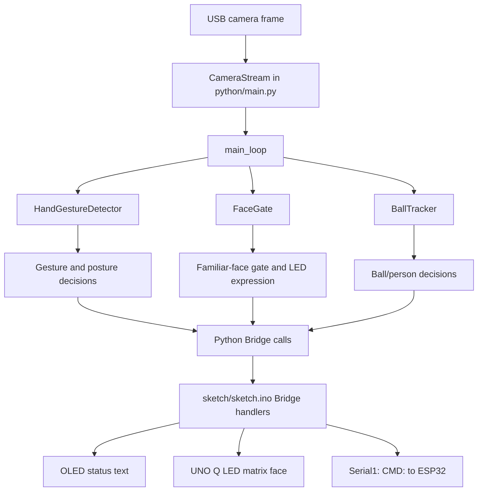

# RoboDog Code Structure and Dataflow

This guide explains how the code in this repository is organized and how data
moves through the RoboDog vision-control system. It focuses on the runtime path
from camera input, through Python perception and decision logic, to Arduino
Bridge calls and motor/display output.

## High-Level Architecture

The project is split into two main runtime halves:

- `python/`: runs the camera, vision models, gesture logic, face gate, ball
  chasing logic, and high-level robot state machine.
- `sketch/`: runs on the Arduino UNO Q side, exposes Bridge functions to
  Python, updates the OLED and LED matrix, and forwards motor/camera commands to
  the downstream ESP32 controller over `Serial1`.

The ESP32 motor/servo firmware is not included in this repository. This project
only validates and forwards compact one-character commands to it.



## Repository Map

| Path | Purpose |
| --- | --- |
| `README.md` | Short setup note, camera path, and face-enrollment command. |
| `app.yaml` | App Lab metadata for the DogVision app. |
| `sketch/sketch.ino` | Arduino-side Bridge handlers, OLED output, LED matrix faces, and UART forwarding. |
| `sketch/sketch.yaml` | Arduino profile and library dependency declaration. |
| `python/main.py` | Main runtime coordinator: camera stream, model instances, state machines, gesture decisions, and Bridge calls. |
| `python/detector.py` | Wrapper around the MediaPipe palm and hand-pose ONNX models. Returns 21 hand landmarks per detected hand. |
| `python/hand_models/` | Low-level OpenCV DNN wrappers and ONNX files for palm detection and hand-pose estimation. |
| `python/face_gate.py` | Face detection and recognition gate using YuNet and SFace models. |
| `python/enroll_faces.py` | Builds `known_faces_db.json` from images under `python/known_faces/<person-name>/`. |
| `python/ball_tracker.py` | YOLOv8n object detector for sports-ball chasing and person/legs-only detection. |
| `python/known_faces/` | Source photos for known-face enrollment. Treat these as personal data. |
| `python/known_faces_db.json` | Averaged face embeddings loaded by `FaceGate` at startup. |
| `python/requirements.txt` | Python dependencies for OpenCV, NumPy, and serial support. |

## Startup Dataflow

1. The Arduino sketch starts `Serial1`, initializes I2C, the OLED, the UNO Q LED
   matrix, and the Arduino Router Bridge.
2. `sketch/sketch.ino` registers three Bridge functions:
   `update_oled`, `send_motor_command`, and `update_face_matrix`.
3. `python/main.py` creates a Python `Bridge` instance and starts
   `CameraStream` for the hard-coded webcam path.
4. `python/main.py` creates the vision helpers:
   `HandGestureDetector`, `FaceGate`, and `BallTracker`.
5. `verify_face_models()` checks that the YuNet and SFace ONNX files can be
   loaded by OpenCV.
6. `App.run(user_loop=main_loop)` starts the repeated Python control loop. If
   the App Lab `App` object is unavailable, the file falls back to a plain
   infinite loop.

## Main Frame Dataflow

`CameraStream` owns a background thread that continuously reads frames from the
webcam. It stores only the newest frame behind a lock, so `main_loop` always
works with the latest available image instead of a long queue of old frames.

Each pass through `main_loop` follows this broad flow:

1. Read the latest camera frame.
2. Mirror the frame with `cv2.flip(frame, 1)` so gestures feel natural to the
   person facing the robot.
3. If the robot is in `STATE_CHASING`, run the ball-chasing path immediately.
4. Otherwise, respect command cooldowns and process only every third inference
   pass to reduce CPU load.
5. Run hand detection on the current frame.
6. Run face recognition periodically:
   - every `FACE_CHECK_PERIOD_S` in normal mode.
   - every `CAMERA_SCAN_FACE_CHECK_PERIOD_S` while scanning upward.
7. Optionally run person detection to check whether only a person's legs are in
   view. This can trigger the camera scan state machine.
8. Convert detector output and current robot state into:
   - one motor/camera command, if needed.
   - one OLED display message.
   - one LED matrix expression update, if face status changed.
9. Send outputs to the Arduino sketch through Bridge calls.

## Bridge And Command Output

Python does not write directly to the ESP32 controller. It calls Arduino Bridge
functions exposed by `sketch/sketch.ino`.

### Python to Arduino

| Python call | Arduino handler | Result |
| --- | --- | --- |
| `bridge.call("update_oled", text)` | `handle_gesture(String command)` | Clears the OLED and prints the text. |
| `bridge.call("update_face_matrix", expression)` | `handle_face_expression(String expression)` | Draws smiley, indifferent, or neutral LED matrix face. |
| `bridge.call("send_motor_command", command)` | `send_motor_command(String command)` | Validates and forwards a command to `Serial1`. |

### Arduino to ESP32

`send_motor_command` accepts only a single supported character. If it passes the
whitelist, the sketch sends this UART frame:

```text
CMD:<char>
```

with a newline after the character. For example, the walk command becomes:

```text
CMD:w
```

This framing prevents random serial noise from being treated as a movement or
camera command.

## Command Table

These commands are emitted by the current Python code:

| Character | Python meaning | Main producer |
| --- | --- | --- |
| `w` | Walk forward | Point-up gesture, ball centered while chasing |
| `s` | Stop; also used as stand-up command | Open palm, ball found, manual stop, cooldown exits |
| `a` | Turn left | Point-left gesture, ball left of center |
| `d` | Turn right | Point-right gesture, ball right of center |
| `q` | Sit | Point-down while standing; point-up while prone |
| `c` | Prone | Point-down while sitting |
| `h` | Camera fixed up | `set_cam_state("U")` support |
| `l` | Camera fixed down | Ball mode entry via `set_cam_state("D")` |
| `n` | Camera neutral or timed scan return | Scan return and ball-mode exit |
| `r` | Start timed upward camera scan | Legs-only person detection |
| `x` | Stop upward camera scan and hold | Hand or face found during scan |

`sketch/sketch.ino` also whitelists `b`, `p`, `g`, `u`, `j`, `z`, `e`, `f`,
and `k`. Those commands are accepted by the Arduino sketch but are not emitted
by the current Python code, so their final meaning must be checked in the ESP32
firmware.

## Robot State Machine

`python/main.py` tracks posture and behavior with `robot_state`:

| State | Meaning |
| --- | --- |
| `STATE_STANDING` | Normal gesture-control mode. |
| `STATE_SITTING` | Sitting posture; only point-up and point-down transitions are handled. |
| `STATE_PRONE` | Prone posture; point-up returns to sitting. |
| `STATE_CHASING` | Autonomous ball-chasing mode. |

Gesture handling depends on the current state:

| Current state | Gesture | Command | Next state |
| --- | --- | --- | --- |
| Standing | Open palm | `s` | Standing |
| Standing | Point up | `w` | Standing |
| Standing | Point left | `a` | Standing |
| Standing | Point right | `d` | Standing |
| Standing | Point down | `q` | Sitting |
| Standing | Fist | `s`, then ball tracker starts | Chasing |
| Sitting | Point up | `s` | Standing |
| Sitting | Point down | `c` | Prone |
| Prone | Point up | `q` | Sitting |
| Chasing | Point down during manual-stop check | `s` | Standing |

The code uses two cooldowns:

- `COMMAND_COOLDOWN_S` for normal movement commands.
- `POSTURE_TRANSITION_COOLDOWN_S` for posture changes, which need more time for
  the robot body to finish moving.

## Face Gate Dataflow

Face recognition is used as a control permission gate and as user feedback.

1. `enroll_faces.py` reads images from `python/known_faces/<person-name>/`.
2. For each usable image, it detects the largest face, aligns it, extracts an
   SFace embedding, and averages embeddings per person.
3. The averaged embeddings are saved to `python/known_faces_db.json`.
4. `FaceGate` loads this JSON file when `python/main.py` starts.
5. During runtime, `face_gate.recognize(frame)` returns:
   - `familiar` when the best known embedding score meets
     `FACE_MATCH_THRESHOLD`.
   - `unfamiliar` when a face is seen but does not match.
   - `none` when no usable face is detected.
6. A familiar face updates `last_familiar_time` and draws the smiley matrix.
7. An unfamiliar face draws the indifferent matrix.
8. If `REQUIRE_FAMILIAR_FACE` is `True`, hand commands are accepted only during
   the `FAMILIAR_GRACE_S` window after the last familiar recognition.

The robot still detects hands and updates displays when the face is unfamiliar,
but movement commands are ignored.

## Camera Scan Dataflow

The scan logic tries to raise the camera when the model sees only the lower part
of a person, then stop when a hand or face comes into view.

The camera scan state machine is separate from the posture state machine:

| Scan state | Trigger | Action |
| --- | --- | --- |
| `IDLE` | Legs-only person box while standing and no hand is visible | Send `r`, start upward scan |
| `SCANNING` | Face detected | Send `x`, lock camera |
| `SCANNING` | Hand detected for `CAMERA_HAND_CONFIRMATIONS` checks | Send `x`, lock camera |
| `SCANNING` | `CAMERA_SCAN_TIMEOUT_S` expires | Send `n`, return camera |
| `LOCKED` | Hand or face still visible | Keep camera position |
| `LOCKED` | Target lost for `CAMERA_TARGET_LOST_S` | Send `n`, return camera |
| `RETURNING` | Recorded return time elapsed | Return to `IDLE` |

The duration of the upward scan is recorded. When the camera returns, the code
sends `n` and waits for the same amount of time before allowing new camera
commands. That keeps Python from interrupting the ESP32 while the servo is
moving back.

## Ball Chasing Dataflow

Ball mode starts when the robot is standing and sees a fist gesture. On entry,
`main.py` sends `s`, switches `robot_state` to `STATE_CHASING`, calls
`ball_tracker.start_chase()`, and points the camera down with `l`.

While chasing:

1. Every few frames, `main.py` checks for a point-down hand gesture to stop ball
   mode manually.
2. `BallTracker.command_for_frame(frame)` runs YOLOv8n on the current frame.
3. If a sports ball is visible:
   - large enough radius means the ball is found, so the robot stops.
   - ball left of center means turn left.
   - ball right of center means turn right.
   - ball near center means walk forward.
4. If the ball has never been seen and the timeout expires, the robot gives up.
5. If the ball was seen before but is now lost, the robot spins toward the side
   where it last saw the ball until the lost-ball timeout expires.
6. When ball mode exits, `main.py` returns to `STATE_STANDING` and sends the
   camera back to neutral.

## Display Dataflow

Two output surfaces give feedback:

- OLED: `_update_oled(display_text)` sends status text only when it changes.
  This avoids unnecessary Bridge traffic. The Arduino handler clears the OLED
  and prints the new text.
- LED matrix: `set_face_matrix(expression)` also deduplicates updates. The
  Arduino handler maps `smiley`, `indifferent`, or any other value to a packed
  13x8 LED matrix frame.

Typical OLED messages include gesture commands, scan state, unfamiliar-face
ignores, ball-search status, and camera errors.

## How To Modify The System

### Add or change a gesture

1. Use the existing landmark helpers in `python/main.py` or
   `python/detector.py` to define the hand shape.
2. Add the decision inside the relevant `robot_state` branch in `main_loop`.
3. If the gesture sends a new command character, add a Python constant in
   `main.py`.
4. Add the command to `is_supported_esp_command()` in `sketch/sketch.ino`.
5. Add matching behavior in the ESP32 firmware, because this repo only forwards
   the command.
6. Update the command table in this guide.

### Tune recognition behavior

- Hand sensitivity: adjust `score_threshold` and `conf_threshold` where
  `HandGestureDetector` is created in `main.py`.
- Face matching strictness: adjust `FACE_MATCH_THRESHOLD` in `face_gate.py`.
- Familiar control window: adjust `FAMILIAR_GRACE_S` in `main.py`.
- Ball chasing behavior: adjust thresholds such as `BALL_FOUND_RADIUS`,
  `BALL_CENTER_DEADZONE`, and timeout constants in `ball_tracker.py`.
- Camera scan behavior: adjust `CAMERA_SCAN_TIMEOUT_S`,
  `CAMERA_TARGET_LOST_S`, and `CAMERA_HAND_CONFIRMATIONS` in `main.py`.

### Change the camera

The webcam path appears in:

- `README.md`
- `app.yaml`
- `python/main.py`

Keep those in sync when moving to a different camera device.

## UNO Q Test Checklist

After pushing changes and pulling them onto the board:

1. Install Python dependencies if needed:
   `python3 -m pip install -r python/requirements.txt`
2. Confirm the camera path exists on the board:
   `ls -l /dev/v4l/by-id/usb-046d_C270_HD_WEBCAM_E21C4540-video-index0`
3. If face photos changed, rebuild the face database:
   `python3 python/enroll_faces.py`
4. Start the DogVision app through App Lab, or run `python3 python/main.py` if
   using the fallback path.
5. Confirm the OLED does not show `CAM FAILED`.
6. Test normal gestures from standing:
   open palm, point up, point left, point right, point down, and fist.
7. Test posture transitions:
   standing to sitting, sitting to prone, prone back to sitting, sitting back to
   standing.
8. Test face gating:
   familiar face should allow commands; unfamiliar face should show feedback but
   ignore commands when `REQUIRE_FAMILIAR_FACE` is enabled.
9. Test ball mode:
   fist enters chasing, point-down exits manually, and a nearby ball stops the
   chase.
10. If possible, monitor the ESP32 serial input and confirm commands arrive as
    `CMD:<char>` frames.
